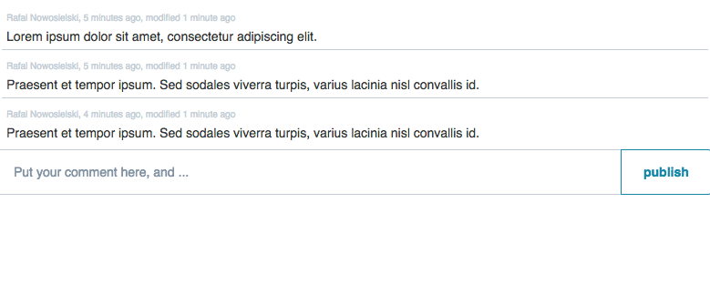

# react-cimpress-comment

This repository stores a react component that anyone can use to conveniently collect and display comments related to platform resources.

## Usage

Install the npm package

`npm install react-cimpress-comment --save`

import the component

`import { Comments } from 'react-cimpress-comment'`

add the css dependencies

```
<link rel="stylesheet" href="https://static.ux.cimpress.io/mcp-ux-css/1.1/release/css/mcp-ux-css.min.css"/>
<link rel="stylesheet" href="//cloud.typography.com/7971714/6011752/css/fonts.css"/>
```

and then use wherever needed

    render() {

        return (
          <div>
            <Comments resourceUri={"https://some_resource_server.cimpress.io/v0/resource/resourceId"}
                      newestFirst={false} editComments={true} accessToken={"accessToken"}/>
          </div>
        );
      }

which will result in something like



There is also a variant of the component that places the comments in a drawer, and provides a button with comment count as a badge that opens the drawer.

`import { CommentsDrawerLink } from 'react-cimpress-comment'`

    render() {

        return (
          <div>
            <CommentsDrawerLink resourceUri={"https://some_resource_server.cimpress.io/v0/resource/resourceId"}
                      newestFirst={false} editComments={true} accessToken={"accessToken"} />
          </div>
        );
      }


Optional props:
- `header` allows overwriting the header/title part
- `footer` allows overwriting the footer part
- `position`, by default "right". Can also move the drawer to the "left" side.

## Publishing a new version to NPM

New patch version: `$ npm version patch [ && npm publish ]` // minor changes

New minor version: `$ npm version minor [ && npm publish ]` // backwards compatible

New major version: `$ npm version major [ && npm publish ]` // breaking changes

Publish a module: $ npm publish


## Development

For developping you can use [storybook](https://github.com/storybooks/storybook)

    npm run storybook

will run both the mockserver and the storybook UI.

During and after development it is good to check or update [BackstopJS](https://github.com/garris/BackstopJS) data. Using the right commands, like

    backstop test

to perform the generation of the test screenshots and their diffs to references and

    backstop approve

to promote images to references if the breaking changes are intended.

Make sure you have backstop installed `npm install -g backstopjs` or use the one in `node_modules`.

